# S3 Multi-Region Access Points

## Overview

This GitHub project focuses on the implementation of S3 Multi-Region Access Points (MRAP), enabling a unified S3 endpoint to efficiently distribute traffic by directing requests to the nearest bucket based on user or application location. With the Multi-Region Access Point, multiple buckets located in different regions can seamlessly handle S3 operations such as GET and PUT, while changes made in one bucket are automatically replicated to all other buckets.

For the purpose of this project, two buckets will be utilized: one in the ap-southeast-2 (Sydney) region and another in the ca-central-1 (Canada Central) region.

## Instructions

### Stage 1 - Creation of the first bucket

1. Access the S3 dashboard by visiting [https://s3.console.aws.amazon.com/s3/buckets](https://s3.console.aws.amazon.com/s3/buckets?region=ap-southeast-2).
2. Click on the "Create bucket" button.
3. Specify the desired **Bucket Name** as "multiregion-sydney".
4. Set the region to `ap-southeast-2` or choose the appropriate region.
5. Enable "Bucket Versioning" under the respective section.
6. Keep the remaining configurations as default and finalize the process by clicking "Create bucket".

### Stage 2 - Creation of the second bucket

1. Proceed to the S3 dashboard using the following link: [https://s3.console.aws.amazon.com/s3/buckets](https://s3.console.aws.amazon.com/s3/buckets?region=ap-southeast-2).
2. Click on the "Create bucket" button.
3. Provide the **Bucket Name** as "multiregion-canada".
4. Set the region to `ca-central-1` or select the desired region.
5. Enable "Bucket Versioning" under the corresponding section.
6. Keep the default settings for other configurations and create the bucket by clicking "Create bucket".
	
	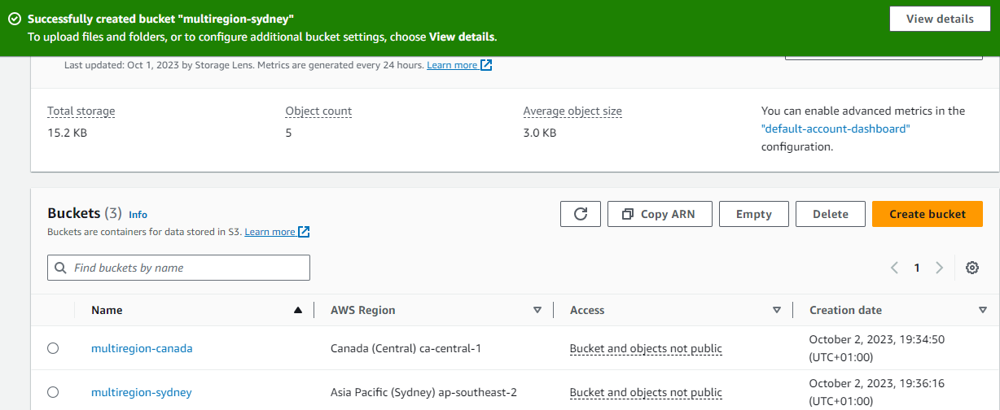

### Stage 3 - Creation of Multi-Region Access Point

1. Access the S3 dashboard by visiting [https://s3.console.aws.amazon.com/s3/buckets](https://s3.console.aws.amazon.com/s3/buckets?region=ap-southeast-2).
2. Navigate to the "Multi-Region Access Points" page and click on the "Create Multi-Region Access Point" button.
	
	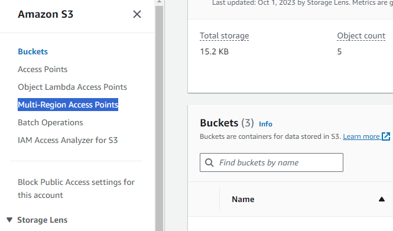
	
3. Set a unique name for the "Multi-Region Access Point" (note that these names are not required to be globally unique).
4. Click on the "Add buckets" button, select the previously created buckets, and confirm the selection by clicking "Add buckets".

	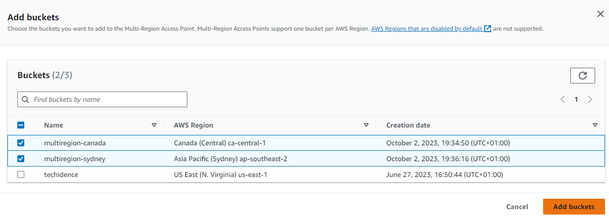
	
5. Maintain the default settings for other configurations and finalize the creation of the Multi-Region Access Point by clicking "Create Multi-Region Access Point".

Please note that the creation process may take up to 24 hours; however, it usually completes within 15 minutes based on our testing.
	
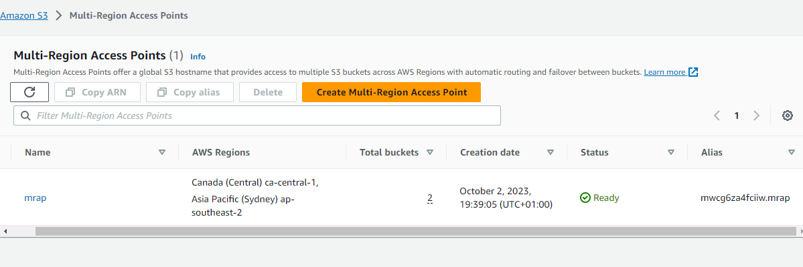

### Stage 4 - Configuration of bucket replication

1. Access the S3 dashboard by visiting [https://s3.console.aws.amazon.com/s3/buckets](https://s3.console.aws.amazon.com/s3/buckets?region=ap-southeast-2).
2. Navigate to the "Multi-Region Access Points" page and locate the previously created access point. Click on it to proceed.
3. Move to the "Replication and failover" page.
4. Under "Replication rules," click on the "Create replication rules" button.
5. Ensure that "Replicate objects among all specified buckets" is selected and verify that all buckets within this access point are checked.
6. Under "Scope," choose "Apply to all objects in the bucket".
7. Retain the default settings for other configurations and finalize the creation of replication rules by clicking "Create replication rules".

At this stage, both buckets are set up to replicate changes to each other, ensuring data consistency and redundancy across regions.
	
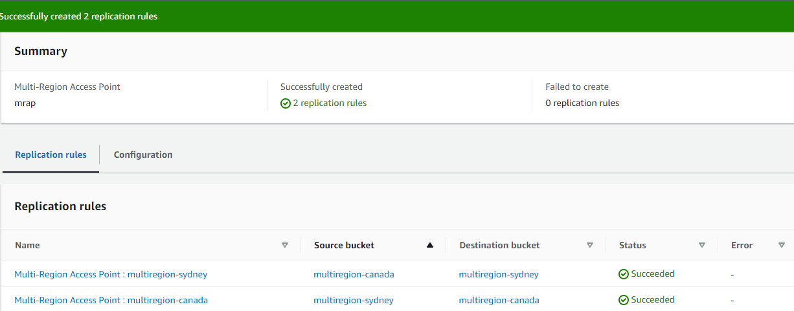

## Stage 4 - Testing using the Multi-Region Access Point (MRAP)

To begin the testing process using the MRAP, please follow these steps:

1. Access the S3 dashboard by visiting the following link: [https://s3.console.aws.amazon.com/s3/mraps](https://s3.console.aws.amazon.com/s3/mraps).
2. Navigate to the Multi-Region Access Points page.
3. Select your access point and click on <kbd>Copy ARN</kbd>. Make sure to keep this ARN handy for the next step.

	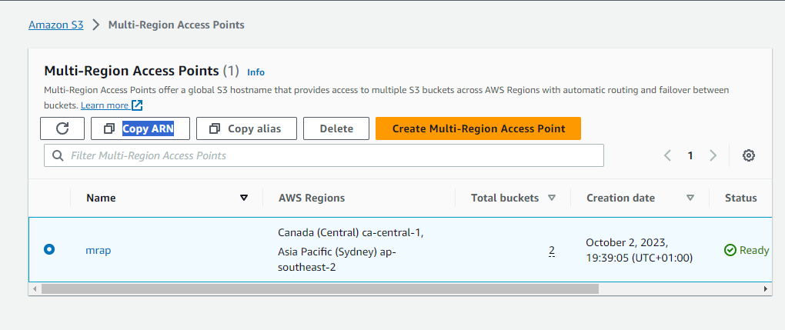

In order to perform the testing, we will utilize the AWS CloudShell available in 'ap-northeast-1' which is in Tokyo. This service enables us to connect to S3 from different regions. Connecting from your local PC would always route you to the closest bucket based on your ISP's location.

Please note that CloudShell is not available in all regions. To verify the available regions for CloudShell, refer to this link: [https://docs.aws.amazon.com/general/latest/gr/cloudshell.html](https://docs.aws.amazon.com/general/latest/gr/cloudshell.html)

Ensure that you are in the desired region from where you want to connect, and follow these steps to open CloudShell:

1. Open the CloudShell console.

	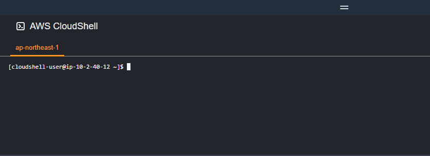

2.	Within the CloudShell console, execute the following commands to create a 10MB file named "test1.file" and upload it to the S3 MRAP ARN you copied earlier:

	```bash
	dd if=/dev/urandom of=test1.file bs=1M count=10

	aws s3 cp test1.file s3://arn:aws:s3::123456789012:accesspoint/mu7cpm7zpa117.mrap/
	```

3.	Since this example is executed from Tokyo, the closest bucket should be Sydney, and therefore, the file should reside in that bucket.

	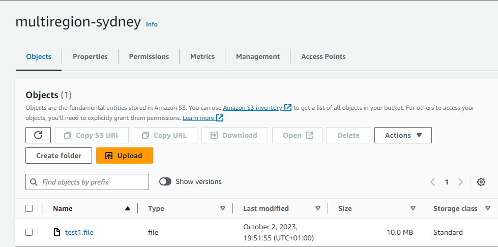

4.	If we check the Canada bucket, we can see that the file has already been replicated.

	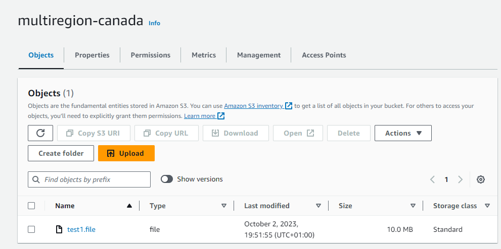

It's important to note that S3 replication is not guaranteed to complete within a fixed timeframe. According to the documentation, it can take hours or even longer for replication to occur: [https://docs.aws.amazon.com/AmazonS3/latest/userguide/replication-troubleshoot.html#:~:text=The majority of objects replicate within 15 minutes%2C but they can sometimes take a couple of hours](https://docs.aws.amazon.com/AmazonS3/latest/userguide/replication-troubleshoot.html#:~:text=The%20majority%20of%20objects%20replicate%20within%2015%20minutes%2C%20but%20they%20can%20sometimes%20take%20a%20couple%20of%20hours)

To mitigate this issue, Replication Time Control (RTC) can be enabled, which accelerates replication and guarantees that 99.99% of objects are replicated within 15 minutes, with "most" objects being replicated in seconds. However, this feature incurs additional costs and is not required for our demonstration purposes.

5.	Let's switch to another region within CloudShell, such as Ohio (us-east-2).
	
	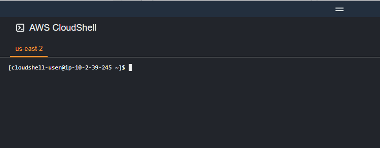

6.	Again, run the following commands while changing the file name to "test2.file":

	```bash
	dd if=/dev/urandom of=test2.file bs=1M count=10

	aws s3 cp test2.file s3://arn:aws:s3::123456789012:accesspoint/mu7cpm7zpa117.mrap/
	```

This time, the file was initially created in Canada, as expected. However, the replication process took a bit longer (remember, S3 does not guarantee immediate replication).

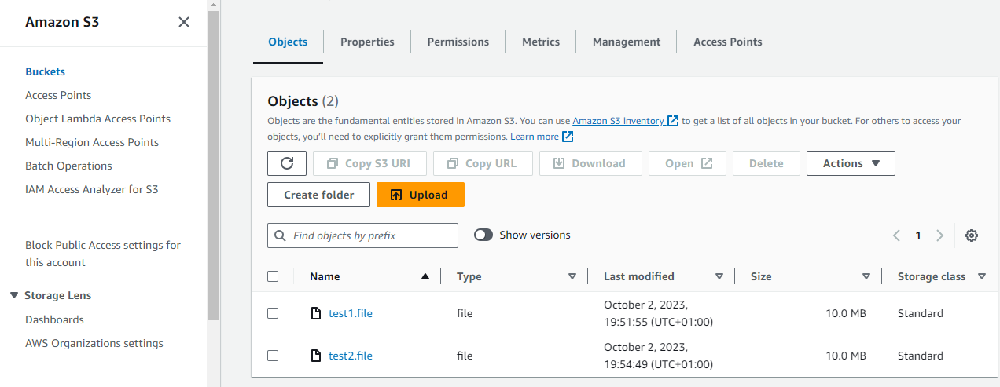

It took approximately 1 minutes for "test2.file" to appear in the Sydney bucket.

7.	As another test, let's choose a region that is geographically close to the center of both buckets. In this case, Mumbai (ap-south-1) is selected.

Please note that while Mumbai may be geographically close to the center, there are various network factors behind the scenes that determine which region is actually the closest.

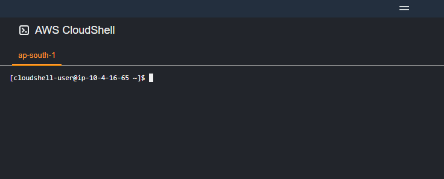

8.	Execute the following command to create a new file named "test3.file" and upload it:

	```bash
	dd if=/dev/urandom of=test3.file bs=1M count=10

	aws s3 cp test3.file s3://arn:aws:s3::123456789012:accesspoint/mu7cpm7zpa117.mrap/
	```

In this case, Sydney wins the race! 🙌

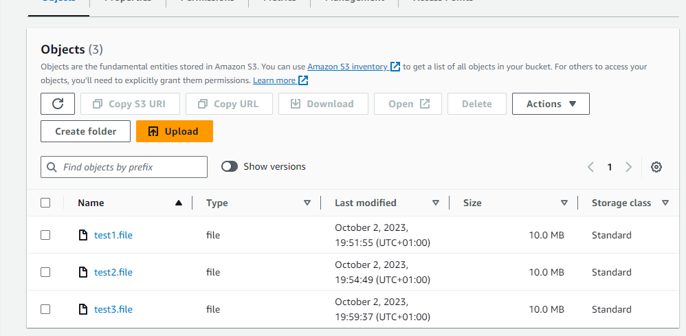

9.	For the final test, we will examine the scenario where we attempt to retrieve an object via our Multi-Region Access Point from one bucket, but our 'get' request is routed to another bucket where the file has not yet been replicated.

	To perform this test, you will need to have two CloudShell instances open, with one connected to each bucket.
	
	You should type in these commands, replace the account number and MRAP ID, before hitting enter.

10.	Execute the following commands in one window (Sydney) to create a new file and upload it:

	```bash
	dd if=/dev/urandom of=test4.file bs=1M count=10

	aws s3 cp test4.file s3://arn:aws:s3::123456789012:accesspoint/mu7cpm7zpa117.mrap/
	```

11.	In another window (Canada), attempt to copy that file to your instance using the following command:

	```bash
	aws s3 cp s3://arn:aws:s3::123456789012:accesspoint/mu7cpm7zpa117.mrap/test4.file .
	```

If you are not quick enough or if replication occurs unusually fast, you might miss out and should start again with a new file name.

The following is an example of what happens when attempting to download a "non-existent" file:

	```bash
	[cloudshell-user@ip-10-4-58-88 ~]$ aws s3 cp s3://arn:aws:s3::123456789012:accesspoint/mu7cpm7zpa117.mrap/test4.file .
	fatal error: An error occurred (404) when calling the HeadObject operation: Key "test4.file" does not exist
	[cloudshell-user@ip-10-4-58-88 ~]$ aws s3 cp s3://arn:aws:s3::123456789012:accesspoint/mu7cpm7zpa117.mrap/test4.file .
	fatal error: An error occurred (404) when calling the HeadObject operation: Key "test4.file" does not exist
	[cloudshell-user@ip-10-4-58-88 ~]$ aws s3 cp s3://arn:aws:s3::123456789012:accesspoint/mu7cpm7zpa117.mrap/test4.file .
	download: s3://arn:aws:s3::123456789012:accesspoint/mu7cpm7zpa117.mrap/test4.file to ./test4.file
	[cloudshell-user@ip-10-4-58-88 ~]$
	```

Therefore, it is crucial to consider that if your application requires immediate availability of all objects, Multi-Region Access Points may not be the optimal solution. Alternatively, ensure that your application can handle 404 errors appropriately.

## Stage 5 - Cleanup Process

To initiate the cleanup process, please follow the steps outlined below:

1. Navigate to the S3 dashboard by accessing the following link: [S3 Dashboard](https://s3.console.aws.amazon.com/s3/mraps).

2. Once on the Multi-Region Access Points page, locate and select the specific access point associated with your project.

3. Click the <kbd>Delete</kbd> button to initiate the deletion process.

   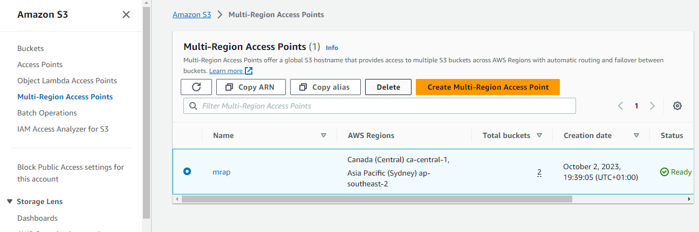

   Please note that the deletion process may require a few minutes to complete. During this time, it may not be possible to delete your buckets.

4. After completing the access point deletion, proceed to the Buckets page.

5. For each bucket that you have created, select the respective bucket and click on the <kbd>Empty</kbd> button.

6. In the confirmation window, enter the phrase "*permanently delete*" and click <kbd>Empty</kbd>.

7. Once both buckets are empty, select each bucket again, and click on the <kbd>Delete</kbd> button.

8. In the confirmation window, enter the name of the bucket and click <kbd>Delete</kbd>.

By following these steps, you will successfully complete the cleanup process for your GitHub project.
